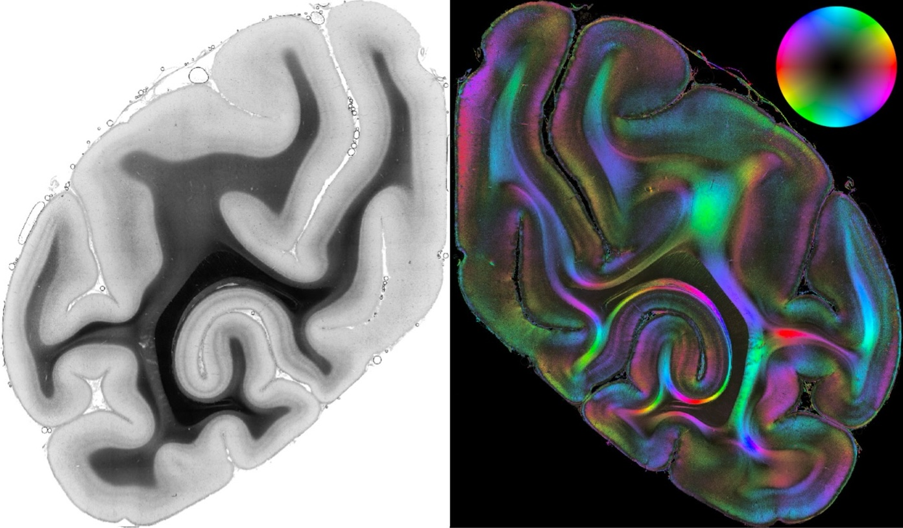

# Transmittance2FOM-GenModels

## Overview

This project explores the use of deep learning generative models to process 3D-Polarized Light Imaging (3D-PLI) data of vervet monkey brains. The goal is twofold:

1. **FOM Generation**: Generate Fiber Orientation Map (FOM) patches using a generative model.
2. **Transmittance-to-FOM Translation**: Implement and evaluate an image-to-image translation model that generates FOM maps from corresponding transmittance maps.

This work involves preprocessing large-scale imaging datasets, training generative models (GANs, Pix2Pix, etc.), and evaluating model outputs using both qualitative visualizations and quantitative metrics.
